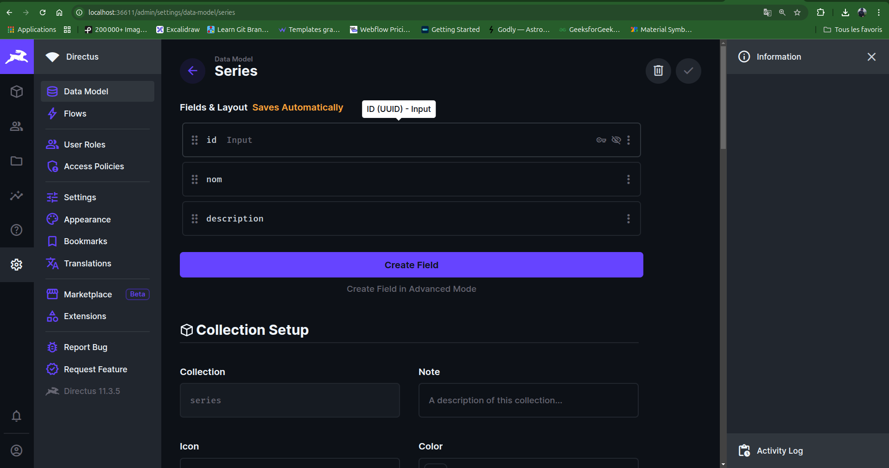
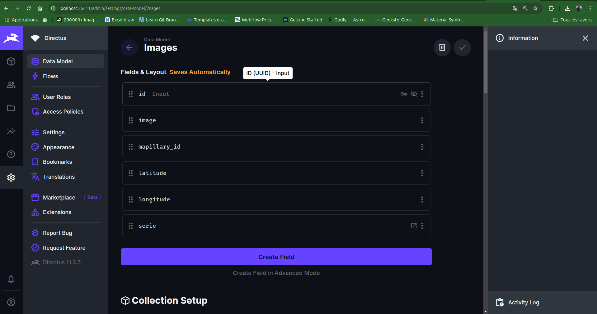
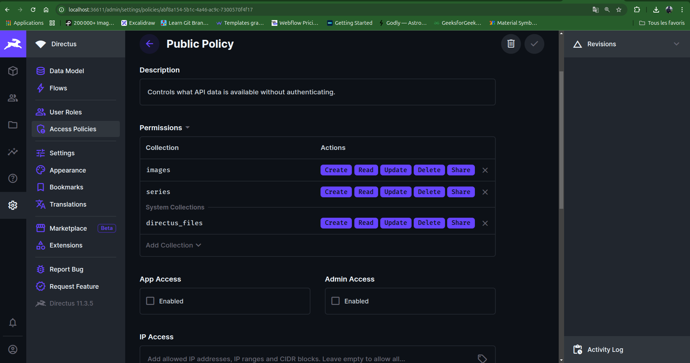
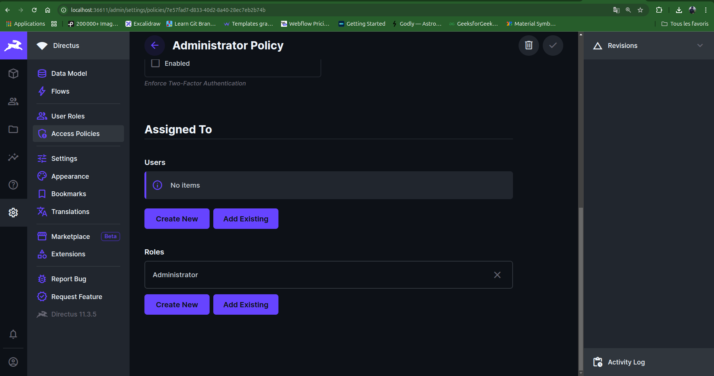
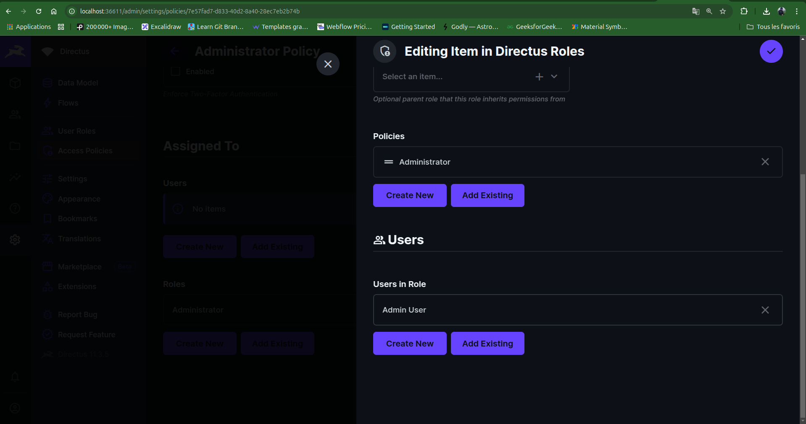
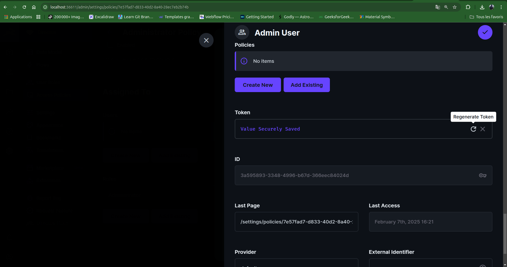

# GeoQuizz

## Liste des développeurs :
- Auger Benjamin
- Benchergui Timothée
- Biechy Maxime
- Khenfer Vadim

## URL Docketu :
```
http:/docketu.iutnc.univ-lorraine.fr:36619
```

## Fonctionnalités réalisées :
Toutes les fonctionnalités prioritaires ont été réalisées. + Fonctionnalités supplémentaires :
- Niveaux de difficulté en choisissant le nombre de photos à trouver et le temps imparti par image
- Le choix de la série de photos à jouer

## Description du projet :
GeoQuizz est un projet de jeu de géolocalisation. Le but du jeu est de trouver la position d'une photo sur une carte. Le joueur doit se déplacer sur la carte pour trouver la position exacte de la photo. Plus le joueur est proche de la position exacte, plus il gagne de points. Le joueur a un temps limité pour trouver la position exacte de la photo.

## Installation du projet :
1. Cloner le projet
   ```bash
    git clone git@github.com:bnj35/Geoquizz.git
   ``` 
2. À la racine du projet, créer deux fichiers "geoquizz.env" et "geoquizzdb.env" et y mettre les variables d'environnement suivantes :
    - geoquizz.env :
      ```env
      DIRECTUS_ADMIN_EMAIL=admin@example.com
      DIRECTUS_ADMIN_PASSWORD=d1r3ctu5
      DIRECTUS_ACCESS_TOKEN=
      DIRECTUS_API_URL=http://host.docker.internal:8055
      JWT_SECRET_KEY='secret'
      ```
      <span style="color:red">IMPORTANT: Remplacer la valeur de DIRECTUS_ACCESS_TOKEN par le token d'accès généré sur directus (voir étape 4)</span><br><br>
    - geoquizzdb.env :
      ```env
      POSTGRES_DB=geoquizz
      POSTGRES_USER=root
      POSTGRES_PASSWORD=pass
      ```
   
3. Lancer les conteneurs Docker
   ```bash
    docker compose up -d
    ```
4. Créer les collections sur directus
   - Se rendre sur http://localhost:8055
   - Se connecter avec les identifiants par défaut ou ceux que vous avez définis dans le fichier geoquizz.env<br><br>
   - Créer une collection "series" avec les champs suivants :
     - <b>id</b> (génération automatique uuid)
     - <b>nom</b> (input de type string)
     - <b>description</b> (input de type string)
     <br><br>
   - Créer une collection "images" avec les champs suivants :
     - <b>id</b> (génération automatique uuid)
     - <b>image</b> (input de type string)
     - <b>latitude</b> (input de type float)
     - <b>longitude</b> (input de type float)
     - <b>mapillary_id</b> (input de type string)
     - <b>serie</b> (relation avec la collection "series" : many to one)
     <br><br>
   - Donner toutes les autorisations à l'utilisateur "public" pour les collections "series" et "images" et "directus_files" (pour les images).<br>N'oubliez pas de sauvegarder les modifications sur directus.
   <br><br>
   - Générer un token d'accès pour l'utilisateur "admin" et le copier pour le mettre dans 'geoguizz.env'. Ne pas oublier de sauvegarder les 3 étapes sur directus.
   <br><br>
   <br><br>
   <br><br>
   - Lancer le script php avec la commande suivante (dans le service docker api.services.geoquizz). <br> Vous pouvez modifier la quantité d'images pour chaque série dans le script "index.php", ligne 180, en modifiant la valeur de la variable $limit.
     ```bash
     docker compose exec api.services.geoquizz php index.php
     ```
     Ce script va insérer des données dans les collections "series" et "images" pour tester l'application
4. Aller dans le dossier appGeoquizz/sql depuis le service docker et exécuter le script "create_databases.php" et ensuite le script "insert_data.php" pour créer la base de données du jeu avec les commandes suivantes :
     ```bash
     docker compose exec api.services.geoquizz php sql/create_databases.php
     docker compose exec api.services.geoquizz php sql/insert_data.php
     ```
     Ces scripts vont créer la base de données du jeu et insérer des données pour tester l'application

5. Installer les dépendances de chaque micro-service du backend et du frontend 
    
    - Backend :
      ```bash
      docker compose exec api.auth.geoquizz composer install
      docker compose exec api.mail.geoquizz composer install
      docker compose exec api.services.geoquizz composer install
      docker compose exec gateway composer install
      ```
    - Frontend :
      ```bash
      docker compose exec frontend npm install
      ```

6. Créer un fichier ".env" à la racine du dossier frontend et y mettre la variable d'environnement suivante :
    ```env
    VITE_API_BASE_URL=http://localhost:6081
   ```
7. Lancer l'application sur un navigateur à l'adresse http://localhost:4545

8. Vous pouvez vous connecter avec les identifiants suivants :
    - email : user1@example.com
    - password : password1

## Tableau de bord :

| Fonctionnalités                                                                                | Statut | Fait par (Backend)           | Fait par (Frontend) |
|------------------------------------------------------------------------------------------------|--------|------------------------------|---------------------|
| Authentification                                                                               | fait   | Timothée                     | Maxime              |
| Directus (image et série)                                                                      | fait   | Maxime                       | Vadim               |
| Calcul de la distance                                                                          | fait   | /                            | Vadim               |
| Gestion des parties                                                                            | fait   | Benjamin / Timothée (un peu) | Vadim               |
| Gestion des scores                                                                             | fait   | Timothée (statistiques)      | Vadim               |
| Scripts de créations des données (directus et classique)                                       | fait   | Maxime                       | /                   |
| Gestion des niveaux de difficulté (le joueur à le droit de choisir le temps pour chaque image) | fait   | Benjamin                     | Vadim               |
| Gestion des messages                                                                           | fait   | Benjamin                     | /                   |
| Gestion des erreurs                                                                            | fait   | Timothée                     | Vadim               |
| Plusieurs séries possible                                                                      | fait   | Maxime                       | Vadim               |
| Profil utilisateur                                                                             | fait   | Timothée                     | Benjamin            |
| Style                                                                                          | fait   | /                            | Benjamin            |


## Front-end :
- Composition API (VueJS 3) 
- Vue Router (SPA)
- Pinia (Store)
- Axios (HTTP)
- TailwindCSS (CSS)
- Leaflet (Map)

## Back-end :
- Directus (CMS headless)
- SQL (PostgreSQL)
